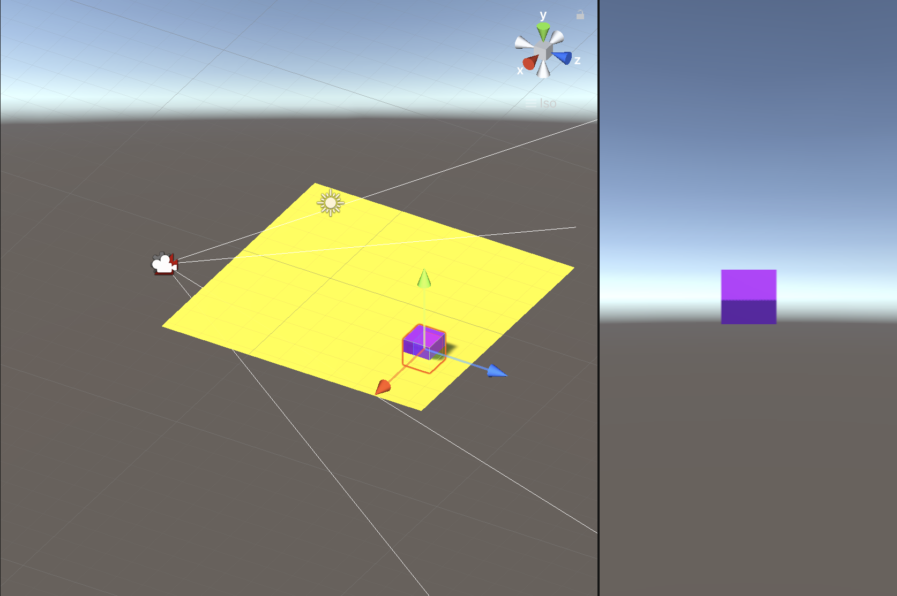
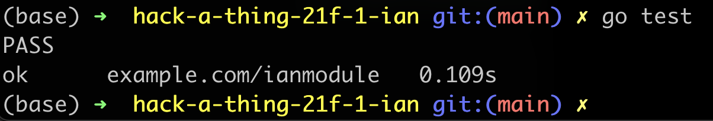
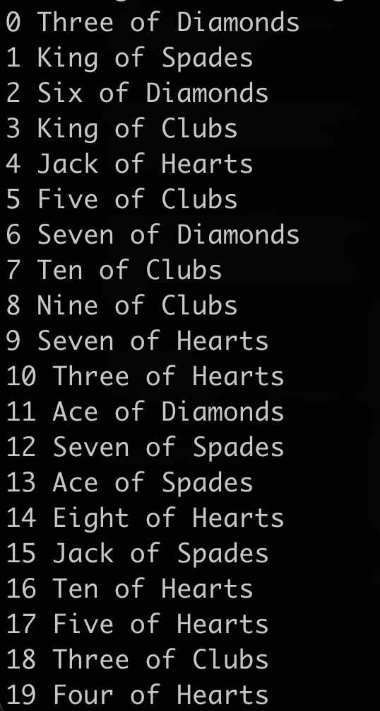

# Hack Technology / Project Attempted

## What you built? 

I initially attempted to follow a Udemy tutorial about C# in Unity 3D. However, this ended up giving me several roadblocks that I determined would hamper my ability to subit something that works. Among these are input variations in the Unity interface. I decided instead to follow a tutorial about Golang, a performant language that I've meant to explore in the past. I created a simple representation of a deck of cards using several functions. `deck` is a type that basically equates to a Go slice. `newDeck()` creates a deck of 52 cards, ordered. `deck.shuffle()`  takes the `deck` and shuffles it in place. I also defined functions to print a deck, dave it to a file, and load it from a file. Testing is managed through `deck_test.go`, which ensures that each deck has the correct number of cards and starts and ends with the correct cards. It also tests saving the deck to the filesystem, and cleans up the file afterward.

Include some screenshots.
[How?](https://help.github.com/articles/about-readmes/#relative-links-and-ima

## Who Did What?

I worked on the entirety of this assignment.

## What you learned

I learned that Unity inputs are really finicky... also that Golang is kind of similar to Python but much faster. However, it requires compilation instead of interpretation.

## Authors

Ian Hou

## Acknowledgments

https://www.udemy.com/course/go-the-complete-developers-guide/

#
